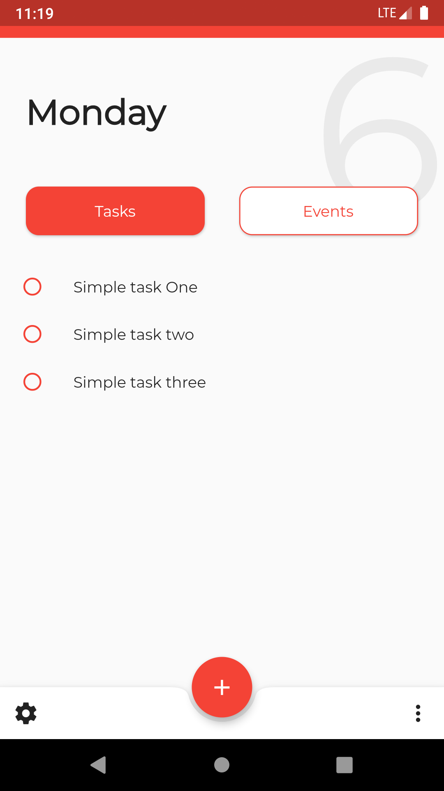
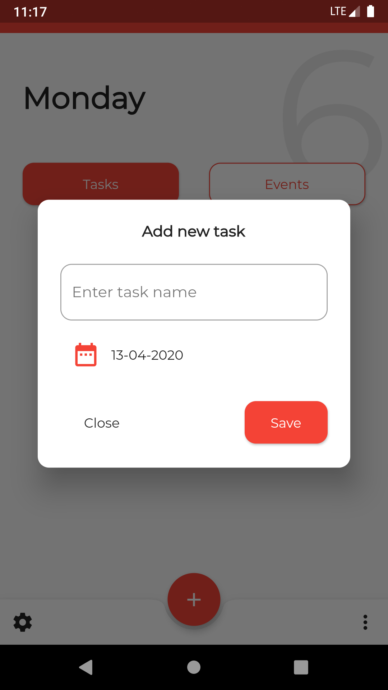
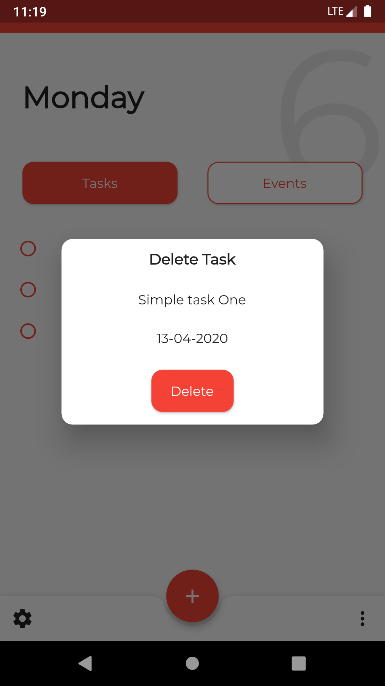
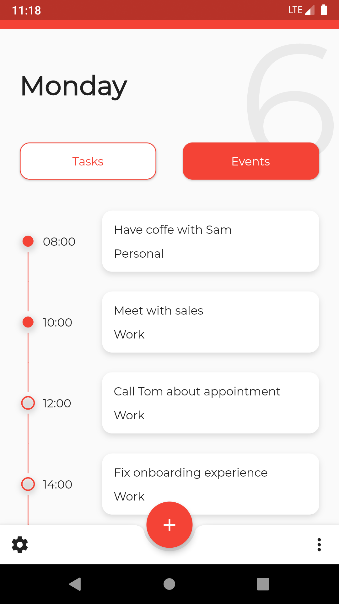
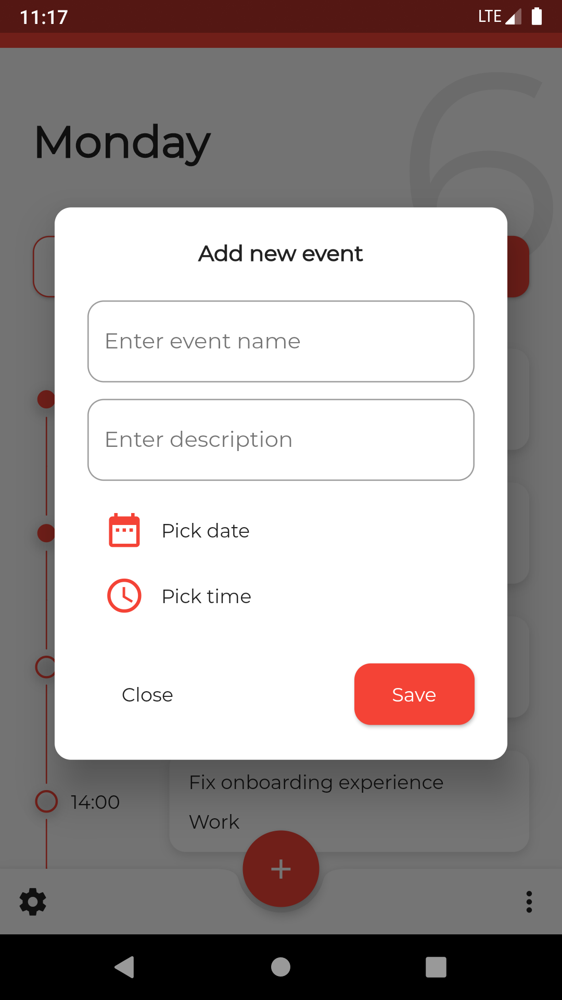
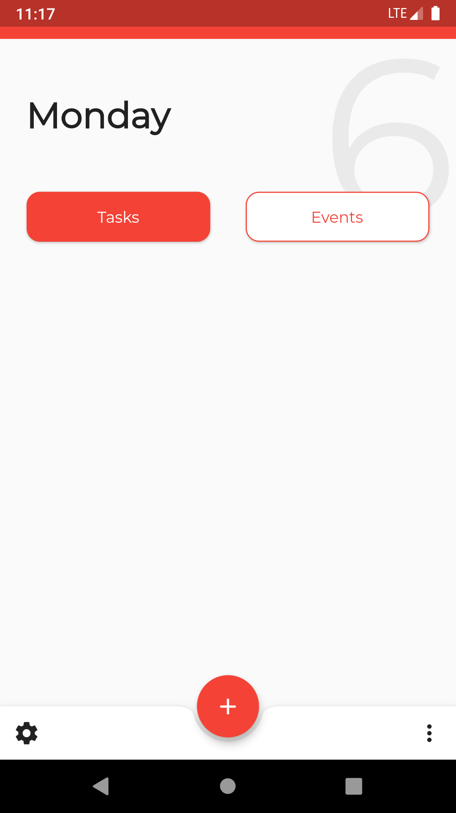

# Getting Started

This project called To-do List App

## Screenshots

||||
|--|--|--|
|  |  | |
|  |  | |

# Command

#### Run flutter application
```bat
flutter emulators --launch <emulator name>
````
#### Generate MOOR
```bat
flutter packages pub run build_runner build
```
#### Build
```bat
flutter build apk
```

# Plugins

- [moor_flutter](https://pub.dev/packages/moor_flutter)
- [intl](https://pub.dev/packages/intl)
- [provider](https://pub.dev/packages/provider)
